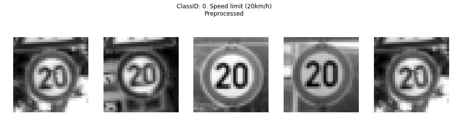

#**Traffic Sign Recognition** 

##Writeup Template

**Build a Traffic Sign Recognition Project**

The goals / steps of this project are the following:

* Load the data set (see below for links to the project data set)
* Explore, summarize and visualize the data set
* Design, train and test a model architecture
* Use the model to make predictions on new images
* Analyze the softmax probabilities of the new images
* Summarize the results with a written report

[//]: # (Image References)

[image01]: ./german_web_images/set_all/0f49174cf4449b30593cee498b1622a2f01be36f.jpg "Traffic Sign 1"
[image02]: ./german_web_images/set_all/25e35cdae0128d4f50e90e31a767efda42cabe65.jpg "Traffic Sign 2"
[image03]: ./german_web_images/set_all/51ab5e6c2ee973f9977e1f9d6f39be96fac1daf8.jpg "Traffic Sign 3"
[image04]: ./german_web_images/set_all/5adbe93b5d248f020cd842da2e5532c33001ca05.jpg "Traffic Sign 4"
[image05]: ./german_web_images/set_all/6b24a3e3a64b754f0717fd680de5920286464063.jpg "Traffic Sign 5"
[image06]: ./german_web_images/set_all/725be33b08d8c62fc0a41ba05f1cb849db62a37a.jpg "Traffic Sign 6"
[image07]: ./german_web_images/set_all/775ee5c29ab8170f9e069f86c0626c10749fa57c.jpg "Traffic Sign 7"
[image08]: ./german_web_images/set_all/ac782b79ffdeacb8d617f68c2a845ad2a0aca2f9.jpg "Traffic Sign 8"
[image09]: ./german_web_images/set_all/af84e13a51ffb84126be8abe6f6ce048ab0bb997.jpg "Traffic Sign 9"
[image10]: ./german_web_images/set_all/d4f200dd91243ec16dc688b14d3caa71215fc910.jpg "Traffic Sign 10"
[image11]: ./german_web_images/set_all/d76e04035d8fb879fe7e6358ba20c7f2da5c74b5.jpg "Traffic Sign 11"
[image12]: ./german_web_images/set_all/dad6a4bc932a6549d6ad0b5913185dea08f458a7.jpg "Traffic Sign 12"

## Rubric Points
###Here I will consider the [rubric points](https://review.udacity.com/#!/rubrics/481/view) individually and describe how I addressed each point in my implementation.  

---
###Writeup / README

####1. Provide a Writeup / README that includes all the rubric points and how you addressed each one. You can submit your writeup as markdown or pdf. You can use this template as a guide for writing the report. The submission includes the project code.

You're reading it! and here is a link to my [project code](https://github.com/pespinoz/CarND-Traffic-Sign-Classifier-Project/blob/master/Traffic_Sign_Classifier.ipynb)

###Data Set Summary & Exploration

####1. Provide a basic summary of the data set. In the code, the analysis should be done using python, numpy and/or pandas methods rather than hardcoding results manually.

I used the NumPy library to calculate summary statistics of the traffic signs data set:

* The size of training set is 34799
* The size of the validation set is 4410
* The size of test set is 12630
* The shape of a traffic sign image is (32, 32, 3)
* The number of unique classes/labels in the data set is 43.

####2. Include an exploratory visualization of the dataset.

The data set consists of images of German traffic signs grouped in training, validation, and test sets. There are 43 unique classes (or labels) in the entire dataset, which names can be found in the included [signnames file](https://github.com/pespinoz/CarND-Traffic-Sign-Classifier-Project/blob/master/signnames.csv).

As an initial visualization of the dataset we plotted 5 randomly selected images for each traffic sign (43 classes). In the title of each figure we print i) the sign name, and ii) the number of counts in the training dataset. Two examples are shown below, that correspond to classes 0 and 14 respectively :

 
 

The rest of these raw figures can be found in the [my_folder/](https://github.com/pespinoz/CarND-Traffic-Sign-Classifier-Project/tree/master/my_images) directory with prefix visualization*.

We then computed the count of each sign in our database, marginalizing by Training, Validation and Test sets. The easiest way to visualize these distributions is with a histogram, as you can see below:

 
where the Training distribution is in red, Validation in tan, and Test in lime. We can see from this histogram that all the Training, Validation, and Test distributions are highly unbalanced  across classes. Their unbalance is *proportionally* similar for the three of them. This is easy to see as the Figure is showing a normalized histogram. This doesn't mean the counts across distributions are similar: Remember the sets' sizes are very different (Training = 34799 images, Validation = 4410 images, and Test = 12630 images). The unbalance could be dealt with by augmenting the dataset.

###Design and Test a Model Architecture

####1. Describe how you preprocessed the image data. What techniques were chosen and why did you choose these techniques? Consider including images showing the output of each preprocessing technique. Pre-processing refers to techniques such as converting to grayscale, normalization, etc. (OPTIONAL: As described in the "Stand Out Suggestions" part of the rubric, if you generated additional data for training, describe why you decided to generate additional data, how you generated the data, and provide example images of the additional data. Then describe the characteristics of the augmented training set like number of images in the set, number of images for each class, etc.)

In the notebook I define two main functions for the pre-processing of our dataset: **preprocessing_grayscale**, and **preprocessing_normalization**. Therefore, we have the *potential* to convert to grayscale and normalize. However I keep the structure in the code such that the CNN can be trained with gray or color images.

Having said that, for the remaining of the results in this project I decided to convert the images to grayscale with **preprocessing_grayscale**. The reasoning is that this somewhat improves my training accuracy, performs faster, and color is not the determinant factor of what makes e.g. a speed limit sign a speed limit sign. 

 The **preprocessing_normalization** function I implemented not only normalizes the dataset to a zero mean, but it actually *extends their dynamic range* and makes it uniform across images.  The minimum in the raw image will correspond to pre-processed -0.5, while maximum in the raw image will correspond to pre-processed 0.5. This improves contrast and significantly improves the visibility of sign features in some images. Two example of a can be seen in the next Figures (classes ), where the images correspond to the samw raw ones in the **DataSet Summary & Exploration** Section:

 
 

The rest of these pre-processed figures can be found in the [my_folder/](https://github.com/pespinoz/CarND-Traffic-Sign-Classifier-Project/tree/master/my_images) directory with prefix preproc*.

Augmenting the dataset could improve the model inference, as we now have under-represented/unbalanced classes and the dataset size is small at ~52000 images. However and although it would represent further improvement, augmenting data was not a necessary step in my implementation as it already fulfilled the project requirements without it. 

####2. Describe what your final model architecture looks like including model type, layers, layer sizes, connectivity, etc.) Consider including a diagram and/or table describing the final model.

My final model consisted of the following layers:

| Layer         		|     Description	        					|  Dimensions |
|:---------------------:|:---------------------------------------------:|:-----------------------------------------|
| Layer 1 |  2D Convolution (3x3 filter with depth=12, stride=1, valid padding)  |   32x32x1 to 30x30x12|
|              |   ReLU activation | |
|              |   Max pooling    (2x2 filter, stride=2, valid padding)     |              30x30x12 to 15x15x12|
| Layer 2 |   2D Convolution (3x3 filter with depth=32, stride=1, valid padding)  |   15x15x12 to 13x13x32|
|              |   ReLU activation |  |
|              |   Max pooling    (2x2 filter, stride=1, valid padding)    |               13x13x32 to 12x12x32|
| Layer 3 |   2D Convolution (3x3 filter with depth=64, stride=1, valid padding)   |  12x12x32 to 10x10x64|
|              |   ReLU activation |  |
| Layer 4 |   2D Convolution (3x3 filter with depth=128, stride=1, valid padding)  |  10x10x64 to 8x8x128|
|              |   ReLU activation| |
|              |   Max pooling    (2x2 filter, stride=3, valid padding)          |          8x8x128  to 4x4x128|
| Layer 5 |   Fully-connected (512 neurons)   |                                        4x4x128  to 512|
|              |   ReLU activation| |
|              |   Dropout        (keep_prob = 0.7)| |
| Layer 6 |   Fully-connected (128 neurons)     |                                      512      to 128|
|              |   ReLU activation| |
|              |   Dropout        (keep_prob = 0.7)| |
| Layer 7 |   Fully-connected (43 neurons)   |                                         128      to 43|
| |  Softmax				|   43      									|
 
A graphical depiction of the model is given in the next Figure (adapted from [MathWork's Convolutional Neural Network Tutorial](https://www.mathworks.com/discovery/convolutional-neural-network.html)). Note that the seven layers are identified, their dimensions are as in the Table above.

####3. Describe how you trained your model. The discussion can include the type of optimizer, the batch size, number of epochs and any hyperparameters such as learning rate.

To train the model, I used an ....s

####4. Describe the approach taken for finding a solution and getting the validation set accuracy to be at least 0.93. Include in the discussion the results on the training, validation and test sets and where in the code these were calculated. Your approach may have been an iterative process, in which case, outline the steps you took to get to the final solution and why you chose those steps. Perhaps your solution involved an already well known implementation or architecture. In this case, discuss why you think the architecture is suitable for the current problem.

My final model is inspired by the [AlexNet CNN](http://papers.nips.cc/paper/4824-imagenet-classification-with-deep-convolutional-neural-networks). It's composed by 4 convolutional layers (all but one with maxpool) followed by three fully connected layers. This architecture differs from AlexNet mainly due to the small dimension of our dataset images, making i) smaller layer dimensions, and ii) one less convolutional layer. We applied dropout in all but one fully-connected layer for regularization purposes.

My final model results were:
* training set accuracy of ?
* validation set accuracy of ? 
* test set accuracy of ?

If an iterative approach was chosen:
* What was the first architecture that was tried and why was it chosen?
* What were some problems with the initial architecture?
* How was the architecture adjusted and why was it adjusted? Typical adjustments could include choosing a different model architecture, adding or taking away layers (pooling, dropout, convolution, etc), using an activation function or changing the activation function. One common justification for adjusting an architecture would be due to overfitting or underfitting. A high accuracy on the training set but low accuracy on the validation set indicates over fitting; a low accuracy on both sets indicates under fitting.
* Which parameters were tuned? How were they adjusted and why?
* What are some of the important design choices and why were they chosen? For example, why might a convolution layer work well with this problem? How might a dropout layer help with creating a successful model?

If a well known architecture was chosen:
* What architecture was chosen?
* Why did you believe it would be relevant to the traffic sign application?
* How does the final model's accuracy on the training, validation and test set provide evidence that the model is working well?
 

###Test a Model on New Images

####1. Choose five German traffic signs found on the web and provide them in the report. For each image, discuss what quality or qualities might be difficult to classify.

Here are 12 German traffic signs that I found on the web and Udacity discussion forums:

1) ![alt text][image02] 2) ![alt text][image11] 3) ![alt text][image07] 
4) ![alt text][image06] 5) ![alt text][image10] 6) ![alt text][image04]
7) ![alt text][image01] 8) ![alt text][image12] 9) ![alt text][image09] 
10) ![alt text][image08] 11) ![alt text][image03] 12) ![alt text][image05]

This group of images are:

* i) reasonably high-contrast, 
* ii) with zoom similar to most of our dataset, and 
* iii) face-on and not blurry. 

This anticipates a good performance of the classifier, given the accuracy obtained in the Test set (95.4%). However the model can't classify something that it wasn't trained on, and that's the case of image 2). This sign corresponds to a School Zone, which is not present at our original database. Therefore we expect a poor prediction for this image. 

####2. Discuss the model's predictions on these new traffic signs and compare the results to predicting on the test set. At a minimum, discuss what the predictions were, the accuracy on these new predictions, and compare the accuracy to the accuracy on the test set (OPTIONAL: Discuss the results in more detail as described in the "Stand Out Suggestions" part of the rubric).

Here are the results of the prediction:

| Image			        |     Prediction	        					| 
|:---------------------:|:---------------------------------------------:| 
| 01) General Caution | General Caution |
| 02) School Zone | No Entry
| 03) Yield | Yield
| 04) No Passing | No Passing
| 05) Stop | Stop|
| 06) Right-of-way at the next intersection | Right-of-way at the next intersection |
| 07) Yield | Yield  | 
| 08) Speed Limit (30 km/h) | Speed Limit (30 km/h) 
| 09) No Entry | No Entry
| 10) Dangerous curve to the right | Dangerous curve to the right
| 11) Priority Road | Priority Road	|
| 12) Keep Right | Keep Right     |

The model was able to correctly guess 11 of the 12 traffic signs, which gives an accuracy of 91.7%. Although we are dealing with small number statistics (predictions only for 12 new images), our CNN got only 1 wrong. 

As expected, the failed prediction corresponds to the School Zone sign, which wasn't a part of the original dataset. Arguably then, one could say the model got an accuracy of a 100%. Conservatively, we estimate the accuracy of our CNN model as an average of the previous two numbers. At ~95% it compares almost exactly to the Test accuracy of 95.4%.

####3. Describe how certain the model is when predicting on each of the five new images by looking at the softmax probabilities for each prediction. Provide the top 5 softmax probabilities for each image along with the sign type of each probability. (OPTIONAL: as described in the "Stand Out Suggestions" part of the rubric, visualizations can also be provided such as bar charts)

The code for making predictions on my final model is located in the 28th cell of the Ipython notebook, under the *"Output Top 5 Softmax Probabilities For Each Image Found on the Web"* title.

The next Figures provides the top 5 softmax probabilities for each new image, along with the sign name of each probability:

 
 

** (As requested in the question, I'll discuss in detail the first five images here instead of my set of twelve) . But, in summary, there's a high correlation between the certainty of the model's classification and the class representation in the data. This underlies the need for an (augmented) balanced dataset**

* For the first image, the model has a relatively high probability of 0.25 for **General Caution** sign, and the image does contain a *General Caution*. The top five soft max probabilities are shown in the plot above.

* For the second image, we have a set of 5 relatively low soft max probabilities. This is not surprising as the School Zone sign wasn't a part of the original dataset.

* For the third image, the model has a very high probability of 0.42 for **Yield** sign, and the image does contain a *Yield*. The top five soft max probabilities are shown in the plot above. This means the model is quite certain the correct label is *Yield*. The reason might be it's high representation in the dataset (see [histogram of classes](https://github.com/pespinoz/CarND-Traffic-Sign-Classifier-Project/blob/master/my_images/classes_distribution.png), class 13 for the Yield sign).

* For the fourth image, the model has a relatively high probability of 0.28 for **No Passing** sign, and the image does contain a *No Passing*. The top five soft max probabilities are shown in the plot above.

* For the fifth image, the model has a low probability of 0.07 for **Stop** sign, and the image does contain a *Stop*. The top five soft max probabilities are shown in the plot above. The model is not certain at all it's a stop sign! The reason is the relatively low representation of this class in the dataset (see [histogram of classes](https://github.com/pespinoz/CarND-Traffic-Sign-Classifier-Project/blob/master/my_images/classes_distribution.png), class 14 for the Stop sign).

### (Optional) Visualizing the Neural Network (See Step 4 of the Ipython notebook for more details)
####1. Discuss the visual output of your trained network's feature maps. What characteristics did the neural network use to make classifications?

